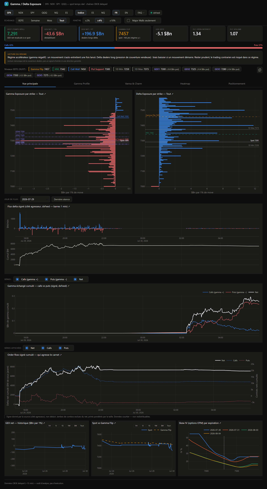
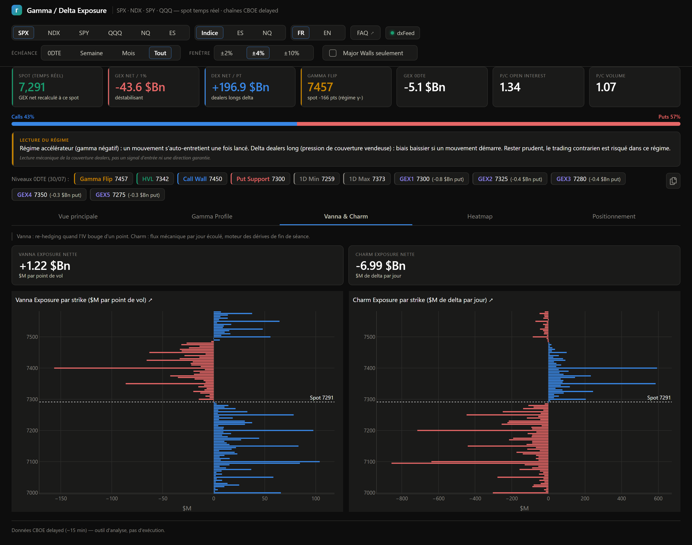
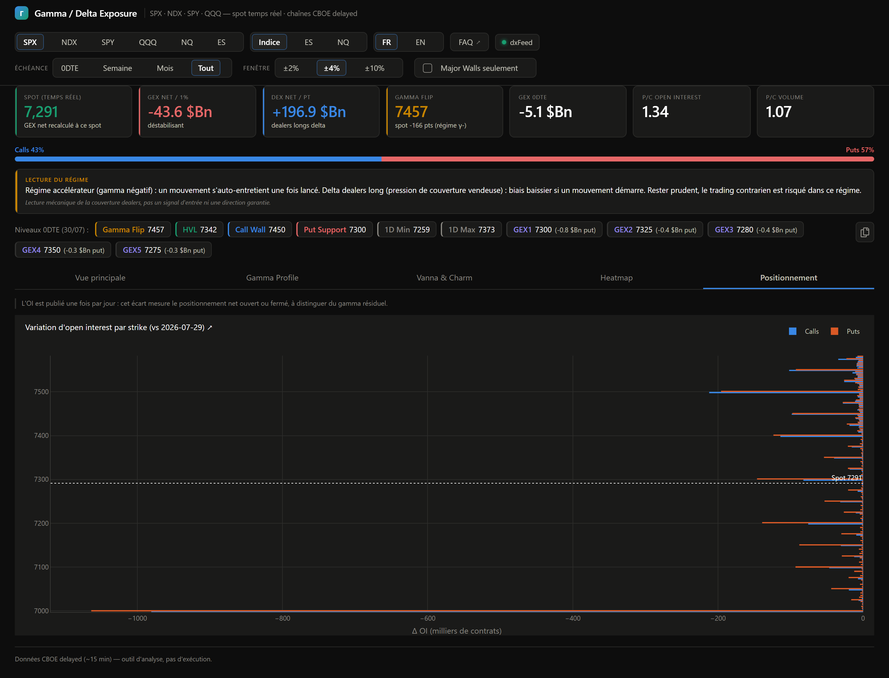

# GEX Dashboard — Gamma/Delta Exposure analytics (SPX, NDX, SPY, QQQ)

*[Version française](README.md)* · *[FAQ](FAQ.en.md)* · *[Disclaimer](DISCLAIMER.md)*

[](https://github.com/Darthreign/gex-dashboard/actions/workflows/tests.yml)

[MIT License](LICENSE) — **analysis tool only**: no trading, no execution,
no investment advice. Every instance pulls its own data from CBOE's public
delayed endpoint; this project redistributes no market data.

> ⚠️ **Trading options and derivatives involves a high risk of loss.**
> This tool is provided for educational purposes, without warranty, and does
> not constitute investment advice. Read the [full disclaimer](DISCLAIMER.md)
> before using it.

## Screenshots

| Main view | Gamma Profile |
|---|---|
|  |  |
| GEX/DEX by strike, 0DTE levels, delta flow, history | Net GEX profile vs spot, broken down by expiration |

| Vanna & Charm | Positioning |
|---|---|
|  |  |
| Second-order Greeks by strike | Open interest change between sessions |

A free, self-hosted alternative in the spirit of SpotGamma: rebuild the
market structure metrics that options dealers' hedging creates — Gamma
Exposure by strike, Gamma Flip (zero gamma), Call/Put Walls, delta flow.

## Data sources

One rule applies everywhere: **use the real-time source when available, the
free one otherwise.**

| | CBOE (public) | dxFeed (broker account) |
|---|---|---|
| Account required | no | yes (free with the account) |
| Freshness | **~15 min delayed** | real time |
| Aggressor side | not observable | **reported by the source** |
| Redistributable | yes | **no** — strictly personal use |

**Nothing essential is missing without a broker account**: every level, every
regime and every chart works on the public source. Only signed order flow and
1-minute futures candles require an account.

### CBOE — default source

Public delayed endpoint (undocumented):
`https://cdn.cboe.com/api/global/delayed_quotes/options/_SPX.json`
(indices prefixed with `_`). One GET returns the full chain — bid/ask, IV,
open interest, volume, Greeks — plus spot. **~15 min delayed**, regenerated
~every 60 s (feed timestamps are UTC). Underlyings tracked: SPX, NDX, SPY and
QQQ (`gex/config.py`).

### dxFeed — when a broker account is configured

What real time actually changes, measured rather than assumed: on the same
0DTE strikes, dxFeed saw **3 to 6 times more volume** than CBOE at the same
instant, for an open interest **identical to the contract**. Not a rougher
source — the same one without the delay.

- **Native chains** for SPX / NDX / SPY / QQQ (`gex/idxopt.py`) and NQ / ES
  (`gex/futopt.py`) — futures options carry their own gamma structure,
  distinct from the transposed index chain.
- **Signed order flow** (`gex/flowtape.py`): every print carries its aggressor
  side, reported by the source. No classification heuristic involved.
- **Real-time spot** and 1-min candles for the Heatmap.

⚠️ This data never leaves the machine: `gex/export.py` only ever exports rows
where `source == "cboe"`.

## Installation

**Beginner, never installed something like this?** → follow the
**[illustrated step-by-step guide](INSTALL.en.md)** (15 min, no knowledge
required, no command line to understand).

Otherwise, the [Claude Code assisted install](#assisted-install-claude-code)
or the [manual quick start](#quick-start) below.

## Assisted install (Claude Code)

If you use [Claude Code](https://claude.com/claude-code), open it in an empty
folder and paste this prompt — it handles everything, including registering the
MCP server:

```
Install the GEX dashboard (SPX/NDX options analytics) on my machine.

Repository: https://github.com/Darthreign/gex-dashboard

Steps:
1. Check that Python 3.11+ and git are available. If either is missing,
   tell me how to install it and stop there.
2. Clone the repository into the current folder and cd into it.
3. Create a .venv virtual environment and install requirements.txt.
4. Run the test suite (pytest tests/ -q) to validate the install:
   all tests must pass.
5. Adapt .mcp.json to my system: replace the "command" value with the
   ABSOLUTE path to the venv python (Windows: .venv\Scripts\python.exe,
   macOS/Linux: .venv/bin/python). The shipped file contains a relative
   Windows path that does not work elsewhere.
6. Start the dashboard (python run.py) and give me the URL to open.
7. Tell me to restart Claude Code from this folder to activate the
   "gex-data" MCP server, and list the tools it exposes.

Important: no account, API key or subscription is required — data comes from
CBOE's free public endpoint. Do not ask me for any credentials. The
backfill.py (Databento) and tt_auth.py (tastytrade) modules are optional and
paid: ignore them entirely.
```

The MCP server then lets you query your own data in natural language
("analyse the current gamma structure", "where are the NDX walls?").

## Quick start

```
python -m venv .venv
.venv/bin/pip install -r requirements.txt        # Windows: .venv\Scripts\pip
.venv/bin/python run.py                          # dashboard on http://127.0.0.1:8050
```

Tests: `.venv/bin/python -m pytest tests/`

### Install as a package (optional)

The project is a standard Python package. Once installed it exposes two
commands, with no need to sit in the source folder:

```
pip install .                      # or: pip install -e .  (development mode)
gex-dashboard                      # start the dashboard
gex-mcp                            # start the MCP server
```

Installed this way, `data/` and `logs/` are created **in the current
directory** (not in the sources): run the command from wherever you want your
history kept.

## MCP server — query your data in natural language

This is what really sets the tool apart from a plain dashboard: once the MCP
server is active, you can ask Claude directly, and it reads your Parquet files
to answer on **your** data.

```
"Where are the gamma walls on NDX?"
"Analyse the current gamma regime on SPX"
"How has net GEX evolved this week?"
"Show me the delta flow from the last session"
```

⚠️ **The MCP server only activates when Claude Code starts, from the project
folder.** If you have just installed the tool, quit Claude Code and relaunch it
from this folder — otherwise the tools stay invisible. This is the one step
that trips people up during installation.

The [`.mcp.json`](.mcp.json) file registers the server automatically. It
contains a **relative Windows path**: on macOS or Linux, replace the `command`
value with the absolute path to `.venv/bin/python`, otherwise the server fails
without a clear error message.

Tools exposed: `get_gex_summary`, `get_gex_by_strike` (gamma walls),
`get_flow_delta`, `get_history`, `get_reports`, `get_log_tail`.

## Discord bot — sharing the verdict (optional)

A separate, lightweight component ([`discord_bot/`](discord_bot/README.md))
relays the gamma-state **verdict** into a Discord channel. Friends see your
conclusion ("Negative gamma on the Nasdaq, contrarian trading risky") **without
a broker account or access to the raw data**: the bot only queries the
dashboard's local API (`/api/v1/digest`), which returns derived analysis only —
never the option chains.

- **Automatic posts** at fixed times (8:30 / 15:25 / 15:35 / 17:30 Paris) and on
  every **regime change** during the US session. Silent on weekends.
- **Verdict by family**: the regime is judged by independent asset class —
  **S&P** (SPX/SPY/ES) and **Nasdaq** (NDX/QQQ/NQ) — not symbol by symbol, with
  more weight on the cash index than the ETF than the future. Color: 🔴 both
  families negative or one strongly negative · 🟠 one family negative or VIX
  high · 🟢 otherwise. A **confidence** line reflects data coverage.
- **On-demand commands**: `!etat`/`!gamma` (digest), `!gamma NQ` (computed
  values), `!niveaux NQ` (GEX levels, transposable: `!niveaux NDX NQ`), any
  chart as an image (`!heatmap NQ`, `!delta SPX`…) and `!help`.

The bot only exposes computed conclusions: that is what makes them shareable
without redistributing a personally-licensed feed. Setup in the
[bot README](discord_bot/README.md).

## Features

- GEX / DEX by strike (±2/4/10 % window), calls/puts breakdown on hover
- 0DTE levels: **Call Wall / Put Wall / GEX3-5** (top gamma strikes),
  **Gamma Flip** (OI-weighted zero gamma), **HVL** (volume-weighted flip)
- Net GEX, P/C ratios, IV skew by expiration, expiry buckets (0DTE/week/month)
- 1-min delta flow (Δvolume×δ proxy) with session picker
- Net GEX & spot-vs-flip history (accumulates automatically while running)
- Optional historical backfill via Databento (`gex/backfill.py`, paid,
  cost quote shown before any download)
- **Signed options order flow** (broker account): aggressor side reported by
  the source, delta-weighted — a hedging-impact measure, not a contract count.
  Combo legs kept out of the net flow.
- VIX in confluence, live when the subscription allows it, delayed otherwise
- MCP server (`gex/mcp_server.py`) to query the data from Claude
- Optional Discord bot ([`discord_bot/`](discord_bot/README.md)) broadcasting the
  gamma-state verdict (derived analysis only) — see above
- Clickable chart titles: each one links to the section of the
  [illustrated guide](docs/guide/README.md) that explains it
- FR/EN interface (browser language auto-detected, manual toggle remembered)

## Computation conventions

- **GEX** ($ per 1 % move) = γ × OI × 100 × spot² × 0.01 — calls positive,
  puts negative (SpotGamma's "naive" convention: dealers long calls, short puts).
- **Gamma Flip**: net GEX profile recomputed over a ±8 % spot grid (IV and
  maturities frozen), zero crossing nearest to spot interpolated.
- **Delta flow** (proxy) = Δvolume between pulls × δ × 100 × spot. Taker
  direction is not observable in this feed: delta-weighted pressure, not
  true signed order flow.
- Expiries set at 16:00 ET; expired contracts excluded; 0DTE kept intraday
  with a 5-minute floor on t.

## Supporting the project

The dashboard is free, ad-free and collects no data — and it will stay that
way. If you use it and it saves you time, you can buy the development a
coffee:

[](https://buymeacoffee.com/dwarfsquirrel)

Entirely optional. A donation grants no support, no priority on features and
no warranty — the terms of the [MIT licence](LICENSE) and the
[disclaimer](DISCLAIMER.md) are unchanged. Reporting a bug or suggesting an
improvement helps just as much.

## Known limits

- 15-min delayed data — structure-reading tool, not an execution tool.
- The CBOE endpoint is not contractual: format may change (ingestion is
  isolated so another source, e.g. Tradier, can be plugged in).
- **SPY and QQQ**: these ETFs pay dividends, while the computation assumes a
  zero yield (q = 0). The approximation stays small on short maturities but
  isn't zero — the SPX and NDX indices don't carry this bias. They also have
  no associated future, so the Index/Futures toggle is inactive for them.
