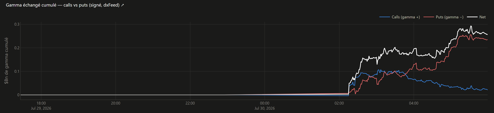
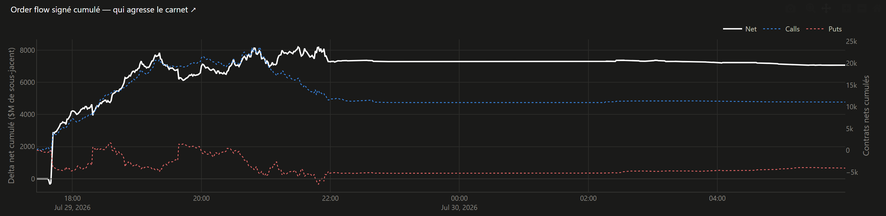

# Onglet 1 — Vue principale

*[← Retour au sommaire](README.md)*

C'est l'onglet qui s'ouvre par défaut : la vue d'ensemble du jour, avec tout ce qu'il faut pour évaluer la structure du marché d'un coup d'œil.

> 💡 **Astuce** : sur le dashboard, **le titre de chaque graphique est cliquable** et renvoie directement à la section de ce guide qui l'explique. Le petit ↗ à la fin du titre le signale.

## En haut : le résumé du jour

Les tuiles, la jauge Calls/Puts, le cadre "Lecture du régime" et la bande de niveaux sont **communs à tous les onglets** — ils restent affichés en permanence, quel que soit l'onglet ouvert en dessous. Chaque chiffre y est expliqué en détail dans [comprendre-les-chiffres.md](comprendre-les-chiffres.md).

## Gamma Exposure par strike

Montre le GEX (voir [comprendre-les-chiffres.md](comprendre-les-chiffres.md) si le terme ne te dit rien), mais **réparti par prix d'exercice** (strike) plutôt qu'en un seul total.

- Chaque barre horizontale correspond à un strike.
- **Bleu** = valeur positive à ce strike, **rouge** = négative.
- Les lignes pointillées superposées (Call Wall, Put Support, Gamma Flip, Spot...) permettent de voir tout de suite où se trouve le prix actuel par rapport aux murs.

C'est le graphique le plus dense de tout le dashboard : il montre en un coup d'œil quels strikes concentrent le plus de gamma, donc de couverture potentielle des dealers.

## Delta Exposure par strike

Même principe, pour le DEX. À lire à côté du précédent : le gamma dit **comment** un mouvement se comporterait, le delta dit **dans quel sens** la couverture pousse.

## Flux delta options

Un graphique en deux parties qui montre, minute par minute, **ce qui se négocie réellement aujourd'hui** (pas les positions déjà installées) :

- En haut, des barres bleues/rouges : le flux net par minute (en millions de dollars).
- En bas, une courbe : le **cumul** depuis l'ouverture — utile pour voir la tendance de fond de la séance plutôt que le bruit minute par minute.

**Le titre te dit quelle source alimente le graphique**, et ça change la lecture :

| Titre | Source | Ce que ça vaut |
|---|---|---|
| « Flux delta options (proxy Δvolume×δ…) » | CBOE public | Le sens acheteur/vendeur **n'est pas observable** : c'est une estimation, pas un vrai flux signé. Délayé de 15 min. |
| « Flux delta **signé** (côté agresseur, dxFeed) » | compte courtier | Le sens vient de la source : on sait qui a traversé le spread. Temps réel. |

## Gamma échangé cumulé — calls vs puts

Le même principe que le flux delta, mais pour le **gamma**, et séparé entre calls et puts (plus une courbe "Net"). Une case à cocher au-dessus permet de n'afficher que les séries qui t'intéressent.

Un décrochage entre la courbe calls et la courbe puts indique de quel côté le marché "se charge" en gamma pendant la séance.

Comme le flux delta, ce graphique existe en version **proxy CBOE** ou **signée dxFeed** — le titre le précise.

## Order flow signé cumulé — qui agresse le carnet

C'est le graphique le plus récent, et le seul qui mesure un **vrai flux d'ordres signé**. Il n'existe qu'avec un compte courtier configuré.

**Ce qu'il montre.** Chaque transaction sur options est classée selon qui a **agressé le carnet** : l'acheteur qui paie l'offre, ou le vendeur qui casse la demande. La courbe cumule ce flux depuis l'ouverture.

- **Elle monte** → les preneurs de liquidité achètent net.
- **Elle descend** → ils vendent net.

**Pourquoi c'est différent des deux graphiques précédents.** Ceux-là estiment l'activité sans savoir qui était à l'initiative. Ici le côté est **fourni par la source**, pas déduit d'une heuristique. Sur 6 583 transactions mesurées lors de la mise au point, aucune n'était indéterminée.

**La courbe "Net" est pondérée par le delta**, pas par le nombre de contrats — c'est ce qui en fait une mesure d'**impact de couverture** plutôt qu'un simple décompte. Acheter 100 calls très loin du prix (delta 0,05) n'oblige le dealer à presque rien ; 100 calls au prix actuel (delta 0,50) le forcent à dix fois plus. Elle se lit en millions de dollars de sous-jacent, sur l'axe de gauche.

Les courbes **Calls** et **Puts** restent en nombre de contrats, sur l'axe de droite — deux unités différentes ne doivent pas partager une échelle.

**Deux précautions prises, à connaître :**

1. **Les jambes de combos sont exclues du net.** Quand quelqu'un monte un spread, chaque jambe apparaît comme une transaction séparée — mais un achat sur une jambe n'est pas un pari directionnel, l'autre jambe part souvent dans l'autre sens. Elles représentaient jusqu'à 23 % des transactions sur SPX, et 49 % sur NDX : les compter aurait faussé le signal.
2. **Tout est pondéré par la taille.** Un lot de 1 contrat ne pèse pas comme un bloc de 500.

⚠️ **Périmètre plus étroit que les autres graphiques.** Pour écouter le flux, il faut dire au fournisseur *quels contrats* suivre — on ne peut pas tout écouter. Le dashboard suit les strikes à moins de **1,5 % du prix actuel**, sur les **2 échéances les plus proches**. C'est là que se traite l'essentiel, mais ça veut dire que les amplitudes de ce graphique ne sont **pas comparables** à celles du proxy CBOE, qui porte sur toute la chaîne.

Cette bande **suit le prix** : dès qu'il s'éloigne du centre de plus de la moitié de la fenêtre, la liste des contrats écoutés est reconstruite autour du nouveau prix. Un mouvement rapide ne fait donc pas décrocher le graphique — utile en scalp/intraday, où le flux compte justement le plus les jours qui bougent.

## GEX net — historique

L'évolution du GEX net dans le temps, avec des boutons **1H / 1J / 1S / 1M / 3M / Tout** pour choisir la profondeur. S'accumule automatiquement au fil des séances.

## Spot vs Gamma Flip

Superpose le prix réel et le Gamma Flip dans le temps. Les croisements entre les deux courbes marquent les **changements de régime** (γ+ ↔ γ−) : au-dessus du Flip la couverture des dealers amortit les mouvements, en dessous elle les amplifie.

## Skew IV

La volatilité implicite par strike, pour chaque échéance proche (une courbe par date) — voir [comprendre-les-chiffres.md](comprendre-les-chiffres.md) pour ce que ça représente.

---

*[← Retour au sommaire](README.md) · [Onglet suivant : Gamma Profile →](2-gamma-profile.md)*
