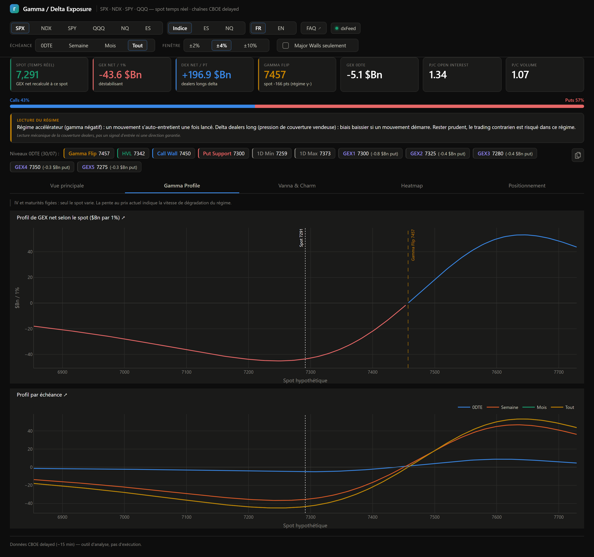

# Onglet 2 — Gamma Profile

*[← Retour au sommaire](README.md)*

Cet onglet répond à une question différente de la Vue principale : *"et si le prix était ailleurs ?"*

## L'idée

Sur la Vue principale, le GEX est calculé **au prix actuel**. Ici, le dashboard fige tout le reste (la volatilité implicite, les échéances, les positions ouvertes) et ne fait varier **que le prix hypothétique** — pour dessiner comment le GEX net évoluerait si le marché montait ou descendait, sans qu'il ait besoin de vraiment bouger pour le savoir.

## Profil de GEX net selon le spot

Le graphique du haut : une courbe qui montre le GEX net ($Bn par 1%) pour chaque prix hypothétique sur l'axe horizontal.

- Là où la courbe est **rouge** (en dessous de zéro), le marché serait en régime accélérateur si le prix s'y trouvait.
- Là où elle est **bleue** (au-dessus de zéro), il serait freiné.
- Les deux lignes verticales pointillées marquent le **spot actuel** et le **Gamma Flip** — le point exact où la courbe traverse zéro.

**La pente de la courbe au niveau du spot actuel** est une information à part entière : plus elle est raide, plus vite le régime changerait pour un petit mouvement de prix.

## Profil par échéance

Le graphique du bas reprend la même idée, mais superpose une courbe par échéance (0DTE, Semaine, Mois, Tout) — pour voir si c'est surtout le court terme ou le plus long terme qui pousse la forme globale de la courbe du dessus.

---

*[← Retour au sommaire](README.md) · [← Vue principale](1-vue-principale.md) · [Onglet suivant : Vanna & Charm →](3-vanna-charm.md)*
