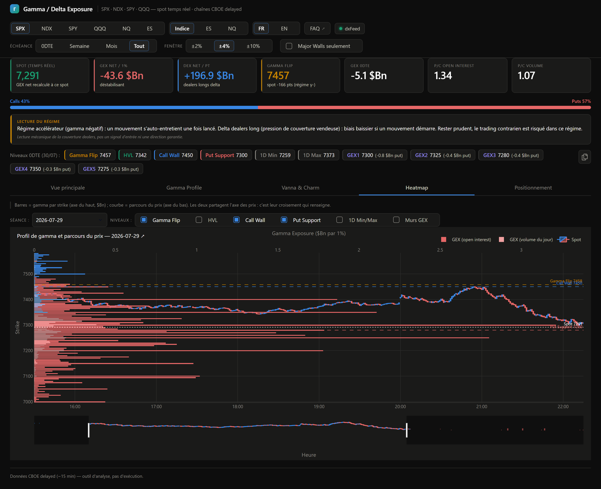

# Onglet 4 — Heatmap

*[← Retour au sommaire](README.md)*

L'onglet le plus visuel : il superpose **le prix réel** et **la structure de gamma** sur le même axe vertical, pour voir directement si le marché évolue au contact d'une concentration de gamma ou à distance.

## Les deux commandes du haut

- **Séance** : choisit le jour à afficher (les jours disponibles sont ceux où au moins une chaîne d'options a été enregistrée).
- **Niveaux** : une liste à cocher pour choisir quelles lignes horizontales afficher (Gamma Flip, HVL, Call Wall, Put Support, 1D Min/Max, Murs GEX) — décoche celles qui ne t'intéressent pas pour alléger le graphique.

## Le graphique

- **Les barres horizontales** (axe du haut, en $Bn) : le gamma par strike, exactement comme sur la Vue principale, mais avec **deux pondérations superposées** — les barres épaisses utilisent l'*open interest* (les positions déjà installées), les barres fines le *volume du jour* (ce qui se traite maintenant). Un strike fin en OI mais épais en volume est un niveau qui **prend de l'importance en cours de séance**, alors qu'il n'existait pas la veille.
- **Les bougies** (axe du bas, en heures) : le parcours réel du prix minute par minute — une vraie bougie japonaise (ouverture/haut/bas/clôture), pas juste une ligne, si le flux temps réel (compte courtier) est actif. Sans lui, seuls les points de chaque pull CBOE sont disponibles (moins précis).

C'est le croisement des deux qui compte : si le prix (en bas) traverse une grosse concentration de gamma (en haut), c'est le signal à surveiller.

💡 Si tu regardes un indice (SPX, NDX...) mais que le sélecteur d'échelle en haut de page est réglé sur "ES" ou "NQ", les bougies affichent le **vrai** historique du future correspondant plutôt qu'une conversion approximative du prix de l'indice.

---

*[← Retour au sommaire](README.md) · [← Vanna & Charm](3-vanna-charm.md) · [Onglet suivant : Positionnement →](5-positionnement.md)*
